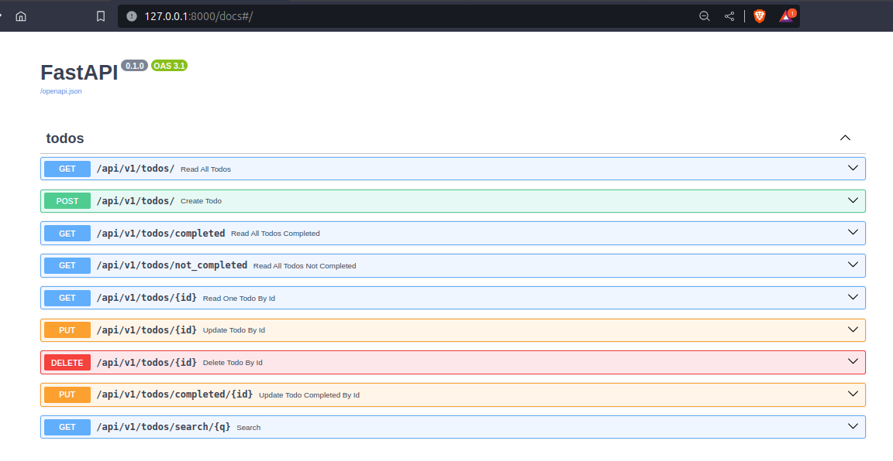

# TodoAPI

### Description
This is a simple API that allows you to create, read, update and delete todos. Built Using fastapi and sqlite

### Features
- Create a todo
- Read a todo
- Update a todo
- search for a todo
- Delete a todo

### Technologies
- FastAPI (for API)
- Sqlite (for database)
- SQLAlchemy (for ORM)
- Pydantic (for data validation)
- databases (for async db operations)

### Installation
- Clone the repo
- cd into the repo
- Create a virtual environment
- Install the requirements (pip install -r requirements.txt)
- Run the app (python main.py)

### Usage
- fastapi swagger docs (http://127.0.0.1:8000/docs/)

